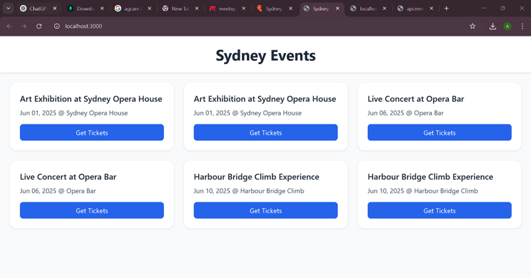

# Sydney Events Aggregator

A minimalistic web app that scrapes upcoming events in Sydney and lets users subscribe via email before redirecting them to ticket sites.

## Features

- **Cheerio**-powered scraper refreshing every hour  
- **Node.js + Express** REST API  
- **MongoDB** (Mongoose) data store  
- **React** frontend with **Tailwind CSS**  
- Email capture subscription flow  

## Prerequisites

- Node.js ≥14  
- npm or yarn  
- MongoDB running (local or Atlas)  

## Getting Started

1. **Clone**  
   ```bash
   git clone https://github.com/yourusername/fullstack-assignment.git
   cd fullstack-assignment

